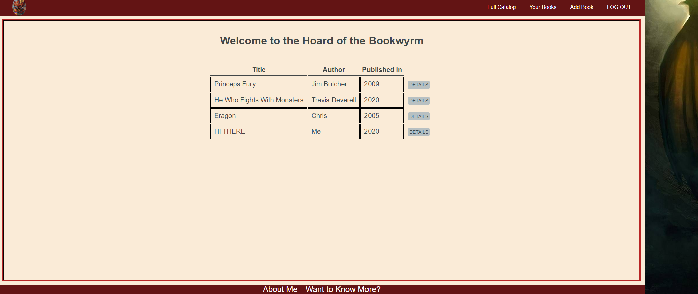
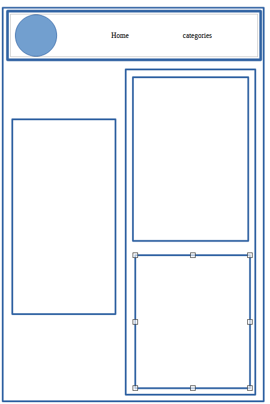

# PROJECT 2: THE VERY HUNGRY BOOKWYRM

I love to read, and I created this website so that people could share their favorite books, and their thoughts on said books, online.

# Screenshot

# Technologies Used

- JavaScript
- HTML
- CSS
- MongoDB
- Heroku hosting

# Getting Started

 
<a href="https://trello.com/b/MZxdD0vw/bookwyrm">My Trello Board</a>  
<a href="https://very-hungry-bookwyrm.herokuapp.com/">View NOW!</a>  

# Next Steps

- Implement star ratings
- write ABOUT ME page
- add pictures of mascot on front page